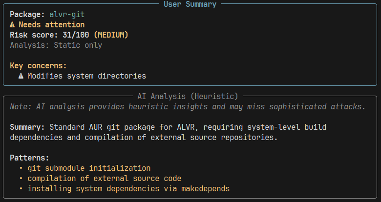

# aur_checker



A command-line tool for analyzing Arch Linux AUR PKGBUILD files to identify security risks. Uses static analysis combined with AI-powered inspection.

[](https://github.com/programmersd21/aur_checker/actions)
[](https://github.com/programmersd21/aur_checker/actions/workflows/codeql.yml)
[](LICENSE.md)
[](https://www.python.org/)

## Overview

aur_checker inspects PKGBUILD files for security vulnerabilities and suspicious patterns. It combines static regex-based analysis with AI review to produce a risk assessment score.

**Analysis pipeline:**
```
PKGBUILD → Fetch → Static Analysis → Metadata → Scoring → AI Review → Risk Verdict
```

## Installation

```bash
git clone https://github.com/programmersd21/aur_checker.git
cd aur_checker
pip install -e .
```

Requires Python 3.10 or later.

## Quick Start

```bash
# Check a single package
aur_checker check keepassx2

# Output as JSON
aur_checker check --json keepassx2

# Check multiple packages
aur_checker batch keepassx2 visual-studio-code-bin

# Check from a file
aur_checker batch --file packages.txt

# AI analysis from previous results
aur_checker explain --input analysis.json

# Build with makepkg
aur_checker install keepassx2

# Clear cached analysis
aur_checker clear-cache
```

## Configuration

### API Key

Set your Google Generative AI API key as an environment variable:

```bash
# Linux/macOS
export AURCHECKER_AI_API_KEY="your-api-key"

# Windows PowerShell
$env:AURCHECKER_AI_API_KEY="your-api-key"
```

### Optional Settings

| Variable | Purpose | Default |
|----------|---------|---------|
| `AURCHECKER_AI_MODEL` | AI model to use | `gemini-3.1-flash-lite` |
| `AURCHECKER_AI_TIMEOUT` | Request timeout (milliseconds) | `120000` |

## How It Works

### Analysis Process

1. **Fetch** - Downloads PKGBUILD from AUR CGit
2. **Static Analysis** - Scans for dangerous patterns via regex
3. **Metadata** - Retrieves AUR RPC v5 package information
4. **Scoring** - Computes 0-100 risk score from signals
5. **AI Review** - Analyzes code structure and context (gemini-3.1-flash-lite)
6. **Verdict** - Blends static (30%) and AI (70%) scores

### Risk Assessment

| Score | Risk Level | Recommendation |
|-------|-----------|-----------------|
| 0-20 | Low | Safe to use |
| 21-50 | Medium | Manual review recommended |
| 51-100 | High | Do not use |

### Security Signals

The static analyzer detects:

| Signal | Pattern | Risk Weight |
|--------|---------|-------------|
| `remote_exec` | Downloads piped to shell (curl/wget pipes) | 50 |
| `external_calls` | Non-source HTTP/HTTPS URLs | 15 |
| `pkg_manager` | Calls to npm, pip, cargo, go, gem, pacman, yay | 10 |
| `orphan_adopted` | Package without active maintainer | 10 |
| `obfuscation` | Base64, hex, eval, openssl, printf+xxd | 30 |
| `system_mod` | Writes to /etc, /usr/lib, /opt, /boot | 30 |
| `maintainer_changed` | Maintainer change detected | 0 |

## Development

### Running Tests

```bash
# Unit tests
pytest

# Type checking
mypy .

# Code style
ruff check .
```

### Project Structure

```
aur_checker/
  __init__.py
  cli.py              # Command-line interface
  analyzer.py         # Static analysis engine
  scorer.py           # Risk scoring logic
  ai.py               # AI integration
  aur_api.py          # AUR RPC client
  cache.py            # Result caching
```

## Architecture

**Core components:**

- **CLI** - Command-line interface with multiple analysis modes
- **Static Analyzer** - Regex-based pattern detection
- **Risk Scorer** - Aggregates signals into single score
- **AI Engine** - Integrates Google Generative AI for context analysis
- **Cache** - Local storage for previous analyses
- **AUR API Client** - Fetches package metadata and PKGBUILD files

## Limitations

- AI analysis requires valid API key and internet connection
- Static analysis uses pattern matching and may miss sophisticated obfuscation
- Risk scores are heuristic-based and should inform, not replace, manual review
- AI responses depend on model quality and may vary between calls

## Contributing

Contributions welcome. Please open an issue or pull request on GitHub.

## License

MIT License. See [LICENSE.md](LICENSE.md) for details.

---

**Maintainer:** [geniussantu1983@gmail.com](mailto:geniussantu1983@gmail.com)

**Repository:** [github.com/programmersd21/aur_checker](https://github.com/programmersd21/aur_checker)
